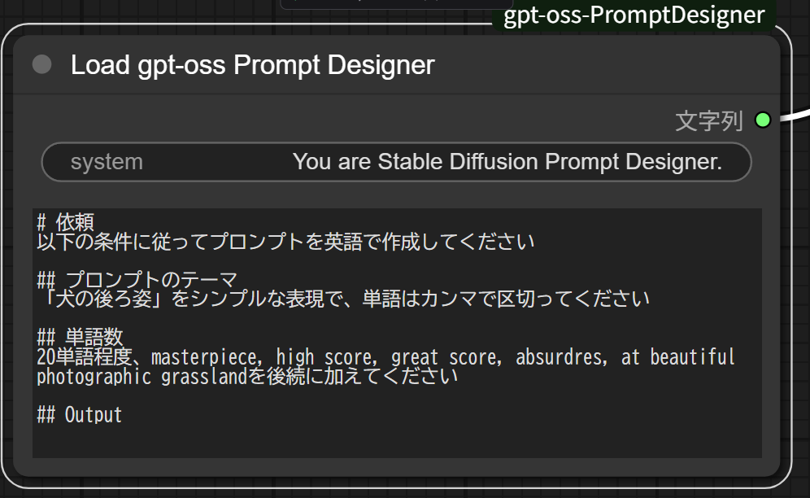

# ComfyUI-gpt-oss-PromptDesigner

## 概要
[ComfyUI](https://github.com/comfyanonymous/ComfyUI)のCustomNode



ollamaのgpt-oss:20bモデルを使ってプロンプトを作成します
ユーザーは作成したいテーマをカスタムノードに入力し実行することで、モデルはStable Diffusionのプロンプトを出力します。
これは、プロンプトの作成をモデルに任せたいときに有効です。

## 前提

- ComfyUI
- Google Colab
    - L4 GPU
        - option: High Memory

## 導入

### 拡張機能をインポートする

```
!git clone https://github.com/educator-art/ComfyUI-gpt-oss-PromptDesigner /content/ComfyUI/custom_nodes/ComfyUI-gpt-oss-PromptDesigner
```

### ollamaをセットアップする

```
# ollamaをインストールする
!curl https://ollama.ai/install.sh | sh
```

```
# ollamaを起動する
!nohup ollama serve &
```

```
# ollamaのモデル"gpt-oss:20b"を取得する
!ollama pull gpt-oss:20b
```
> [!NOTE]
> ollamaをバックグラウンドで起動できる方法をご存じの方はこの限りではありません
> ComfyUI起動時に合わせて起動できると理想です

## ライセンス

 - GPL-3.0 License
